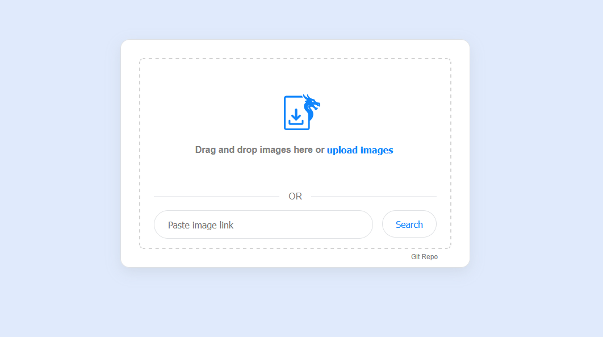

# About

A small personal research project to learn how to:

-   drag and drop files
-   validate an image url
-   copy text to clipboard
-   use css grid layout

## How to Build

1. Open project in VScode
2. Install Live Server extension [https://marketplace.visualstudio.com/items/?itemName=ritwickdey.LiveServer]
3. Click `Go Live` from the VScode status bar
